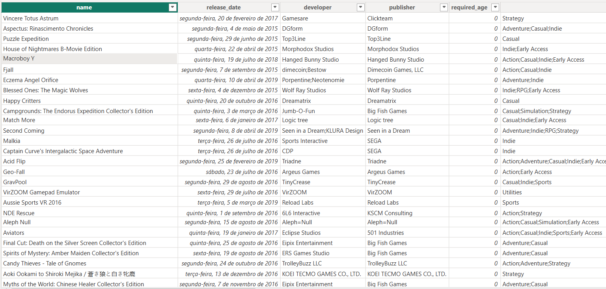

# 🎮 Steam Store Games Analysis Dashboard

## 📖 Sobre o Projeto

Este é um projeto de análise de dados desenvolvido durante a trilha de conhecimentos de **Power BI da Fundação Bradesco**. O objetivo foi aplicar na prática conceitos de Business Intelligence criando um dashboard interativo para explorar o mercado de jogos digitais.

O projeto utiliza dados históricos da plataforma Steam para entender comportamentos de preço, popularidade e tendências de gêneros.

---

## 🎯 Pergunta Norteadora

A análise foi guiada pela seguinte questão:
> **"O que define a popularidade de um jogo? E como o gênero influencia nisso?"**

---

## 📊 Fonte de Dados

Os dados utilizados são do dataset **Steam Store Games**, disponibilizado pelo usuário Nik Davis no Kaggle.
* **Abrangência:** Mais de 27.000 jogos.
* **Período:** Jogos lançados até o ano de 2020.
* **Dados Inclusos:** Gênero, tempo médio de jogo, tags, avaliações, preço, desenvolvedora, entre outros.

*(Exemplo da estrutura dos dados brutos)*

🔗 **Links Úteis:**
* [Dataset no Kaggle](https://www.kaggle.com/nikdavis/steam-store-games)
* [Loja Steam](https://store.steampowered.com/?l=portuguese)
* [Documentação da API Steam](https://steamcommunity.com/dev?l=portuguese)

---

## 🧠 Metodologia e Métricas

Para responder à pergunta norteadora, foi necessário criar métricas que fossem justas entre diferentes gêneros de jogos.

### Métrica de Popularidade e Engajamento
Adotou-se a relação entre **Avaliações Positivas** e **Engajamento**.
O Engajamento foi calculado combinando:
1.  **Tempo de Jogo Médio:** (Average Playtime)
2.  **Mediana do Tempo de Jogo por Gênero:** Para evitar que gêneros com jogadores "hiper focados" (como MMOs) distorcessem a análise global, ofuscando jogos narrativos ou casuais.

### Tratamento de Tags
Para uma análise mais limpa, foram filtradas as tags que repetiam os Gêneros Principais (Ação, Aventura, etc.). Foram mantidas apenas tags descritivas de conteúdo ou estilo (ex: *Puzzle, VR, Story Rich*).
* *Observação:* Apenas cerca de 23% dos jogos possuem essas tags descritivas (que são atribuídas por usuários).

---

## 📈 Visualização (Dashboard)

O dashboard permite a filtragem por gênero, ano e faixa de preço, oferecendo uma visão dinâmica do mercado.

### 💡 Principais Insights

1.  **Variação de Preço (2015-2018):** Observou-se uma queda progressiva no preço médio dos jogos digitais neste período, atingindo o ponto mais baixo em 2018. Após essa data, houve uma tendência de alta (reflexo de mudanças cambiais e da indústria).
2.  **Dominância Indie:** A grande concentração de jogos está na faixa de **R$10 a R$60**. Isso reflete a predominância de jogos do gênero *Indie* na Steam, que possuem custos de produção e venda mais acessíveis.
3.  **Uso de Tags:** A maioria dos jogos não utiliza tags descritivas detalhadas, limitando-se às categorias genéricas.

---

## 🛠 Tecnologias Utilizadas

* **Microsoft Power BI:** Importação, transformação de dados (Power Query), modelagem e visualização.
* **DAX (Data Analysis Expressions):** Criação das medidas de engajamento e popularidade.

## ⚠️ Disclaimer

Este é um **projeto acadêmico sem fins lucrativos**, realizado com base em dados públicos para fins de estudo.
A Steam e a Valve Corporation não estão associadas à produção desta análise.

---

* [👉🏽 Autor do Painel](https://www.linkedin.com/in/patrickrgsanjos/)